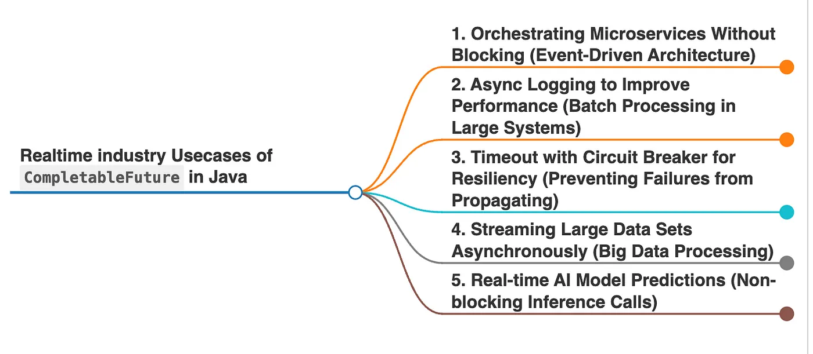

# Completable Future

Introduces in Java 8, represents a future result of asynchronus computation, providing powerful & flexible way to write non-blocking, asynchronous code.

Unlike `future`, which is limited to blocking calls, `completablefuture` supports,

* Chain of tasks            - Attach a sequence of tasks to run after the completion of another.
* Combining multiple task   - Merge results from multiple asynchronous tasks
* Exception handling        - Gracefully manage errors without disrupting the entire flow.
* Asynchronus Callbacks     - Execute tasks without blocking the current thread.

!> CompletableFuture is single-use. Once a CompletableFuture is completed (either by normal completion, timeout, or exception), it cannot be reused.

Real-Time use cases:

## Chaining Dependent Tasks

* Each task depends on the result of the previous one
* The flow is non-blocking, improving system responsiveness.
* `thenApply()` is used to transform the result and pass it to the next stage.

[ChainingDependantTask.java](ChainingDependantTask.java ':include :type=code')

## Combine Result From Multiple Task

* `thenCombine()` merges the results of two independent tasks.

* Ideal for situations where tasks can run in parallel, but their results are needed together.

[CombineResultFromMultipleTask.java](CombineResultFromMultipleTask.java ':include :type=code')

## Handling Timeouts and Fallbacks (Microservice call)

* `completeOnTimeout()` provides a fallback response if the task exceeds the specified timeout.
* Prevents cascading failures in microservices architectures.
* Enhances system availability and user experience.

[ExceptionResilient.java](ExceptionResilient.java ':include :type=code')

## Asynchronous Exception Handling

* exceptionally() handles exceptions without crashing the program.
* Provides meaningful feedback to the user.
* Critical for fault-tolerant systems, especially in financial services.

[ExceptionHandling.java](ExceptionHandling.java ':include :type=code')

## Conclusion

`CompletableFuture` is a game-changer for writing non-blocking, asynchronous code in Java.

* `Parallel Processing:` Improves performance in API aggregations.
* `Task Chaining:` Simplifies complex workflows.
* `Resilience:` Handles failures gracefully with timeouts and exception handling.
* `Scalability:` Reduces thread blocking, enhancing resource utilization.